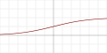

# Deep Learning

- used for a variety of complex tasks:
  - Artificial Neural Networks for Regression and Classification
  - Convolutional Neural Networks for Computer Vision
  - Recurrent Neual Networks for Time Series Analysis
  - Self Organising Maps for Feature Extraction
  - Deep Boltzmann Machines for Recommendation Systems
  - Auto Encoders for Recommendation Systems
- loosely mimics the behaviour of neurons in the brain
- Inputs <-> Hidden Layers <-> Outputs

## History

- popular in the 1980s but computers didn't have the processing power to be useful for complex tasks
- computing power is increasing exponentially (Moore's law, new tech coming e.g. DNA storage)
- Geoffrey Hinton, regarded as pioneer of Deep Learning

## The Neuron

- neurons connected by electrical impulses conected via axons and synapses


```
  Independent vars:     
  standardised or
  normalised
  Input value 1 (X1) -->  synapse (weight 1)  -->                                  Output signal (y)
                                                                  Activation       - binary
  Input value 2 (X2) -->  synapse (weight 2)  -->   Neuron   -->   Function  -->   - continuous
                                                                                   - categorical
  Input value 3 (X3) -->  synapse (weight 3)  -->                                  (multiple outputs)
```

## The Activation Function
- defines the output of that node given an input or set of inputs
- Threshold function (binary)  

  

- Sigmoid function (probability rather than binary)  

  

- Rectifier (commonly used)  

  

- Hyperbolic tangent (similar to sigmoid, allows negative values)  

  

- [more info](https://en.wikipedia.org/wiki/Activation_function#Comparison_of_activation_functions)

## How do Neural Networks work?

- Input features / values (e.g. Area m2, Bedrooms, Age, Dist to CBD)
- Output layer (y) == value of house
- Hidden layer node receives all input values with various weights (weights learned in training)
- Together, the hidden layers will combine to understand dataset relationships

## How do Neural Networks learn?

1. run input values through the NN
2. compare predicted output value to actual value using __cost function__
3. repeat step 1-2 for each row in dataset ( 1 epoch )
4. NN weights are updated, repeast step 1-3

## Gradient Descent

- how are the weights updated?
- cost function result is evaluated by calculating the slope (positive or negative) and weights are adjusted incrementally in the slope direction
- cost function must be convex  
  

## Stochastic Gradient Descent

- also known as incremental gradient descent
- used if cost function is not convex
- updates weights after each row in dataset

## Backpropagation

- algorithm that allows the network to adjust all weights simultaneously

## Training an ANN with Stochastic Gradient Descent

1. Randomly initialise the weights to small numbers close to 0
1. Input the first observation of your dataset in the input layer, each feature in one input node
1. Forward-propagation: the neurons are activated in a way that the impact of each neuron's activity is limited by the weights. Propagate the activations until we get a predicted result y
1. Compare the predicted result to the actual result. Measure the generated error with cost function.
1. Back-propagation: the error is back-propagated. Update the weights according to how much they are responsible for the error. The _learning rate_ decides by how much the weights are incremented.
1. Repeat steps 1-5:
  - updating the weights after each observation (Reinforcement Learning) or
  - updating the weights after a batch of observations (Batch Learning)
1. When the entire training set has passed through the ANN, this is 1 epoch. Run multiple epochs
